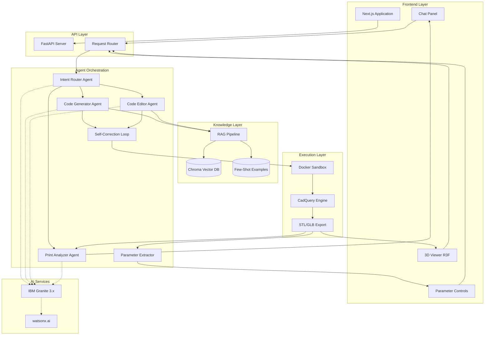
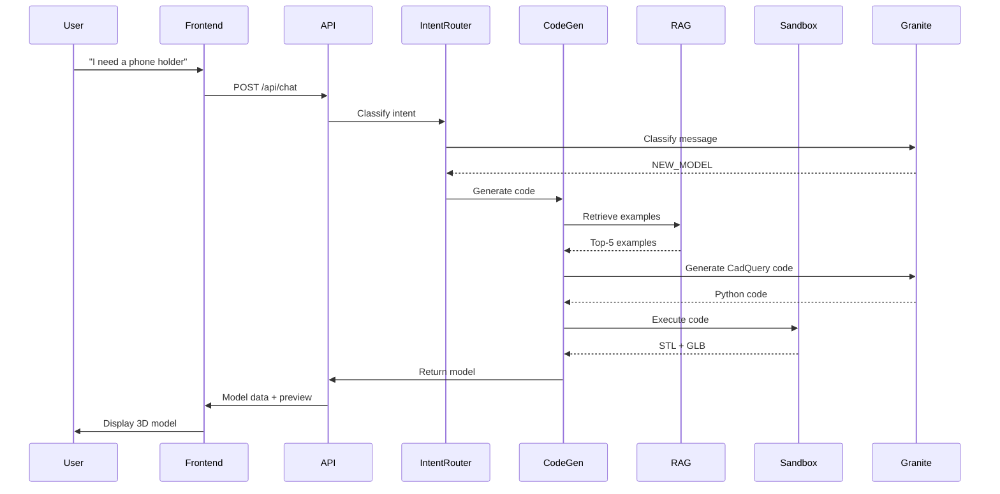
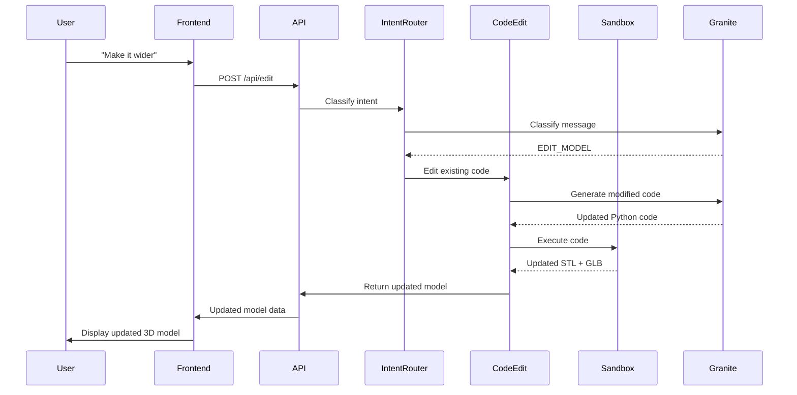
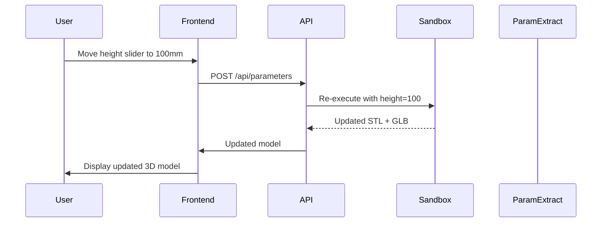

# PromptForge Architecture

## System Overview

PromptForge is a multi-tier application that orchestrates AI agents, CAD execution, and 3D visualization to enable conversational 3D design.

## Implementation Status

**Last Updated:** 2026-06-09

### ✅ Completed Components

#### Phase 1-2: Foundation & Backend Infrastructure
- ✅ Project structure and environment setup
- ✅ FastAPI backend with all core endpoints
- ✅ IBM watsonx.ai client integration
- ✅ Docker sandbox for CadQuery execution
- ✅ Request validation and error handling

#### Phase 3: RAG Pipeline & Knowledge Base
- ✅ Chroma vector database setup
- ✅ Document ingestion pipeline
- ✅ Hybrid retrieval (semantic + keyword)
- ✅ Few-shot example library (25+ examples across 6 categories)
- ✅ RAG integration into FastAPI endpoints

#### Phase 4: AI Agent Implementation
- ✅ Intent Router Agent (classify user requests)
- ✅ Code Generator Agent (with RAG and few-shot)
- ✅ Code Editor Agent (conversational editing)
- ✅ Self-Correction Loop (up to 3 retry attempts)
- ✅ Parameter Extractor (AST-based extraction)

#### Phase 5: Print-Readiness Analysis
- ✅ Geometric analysis engine (wall thickness, overhangs, volumes)
- ✅ AI-powered report generation with Granite
- ✅ FastAPI integration for analysis endpoint

#### Phase 6: Frontend Development
- ✅ Next.js 14 application setup
- ✅ Chat Panel component with markdown rendering
- ✅ 3D Model Viewer with React Three Fiber
- ✅ Parameter Sliders with real-time updates
- ✅ Analysis Report display component
- ✅ Integrated layout with all components

#### Phase 7: Integration & Testing
- ✅ End-to-end workflow testing
- ✅ Integration test suite
- ✅ Unit tests for core components
- ✅ Error handling and edge cases

#### Phase 8: Documentation
- ✅ User Guide (485 lines)
- ✅ API Reference (565 lines)
- ✅ Developer Guide (1050 lines)
- ✅ Architecture documentation (this file)
- ✅ Setup instructions
- ✅ Bob session logs

### 🔄 In Progress

- ⏳ Inline code documentation (docstrings)
- ⏳ Demo script and presentation materials
- ⏳ Example use cases for demo

### 📋 Future Enhancements

See [Future Enhancements](#future-enhancements) section below for Phase 2 and Phase 3 features.

---

## High-Level Architecture



---

## Component Details

### 1. Frontend Layer (Next.js + React)

**Purpose:** User interface for conversational design

**Components:**
- **Chat Panel:** Message history, input field, markdown rendering
- **3D Viewer:** React Three Fiber canvas with orbit controls
- **Parameter Sliders:** Dynamic controls for extracted variables
- **Export Panel:** Download options and print settings

**Technology:**
- Next.js 14 (App Router)
- React 18
- TypeScript
- Tailwind CSS
- React Three Fiber
- Zustand (state management)

**Key Features:**
- Real-time 3D preview
- Responsive design
- Optimistic UI updates
- Error boundaries

---

### 2. API Layer (FastAPI)

**Purpose:** HTTP interface between frontend and backend services

**Endpoints:**
```
POST   /api/chat              # Main conversational endpoint
POST   /api/generate          # Direct model generation
POST   /api/edit              # Edit existing model
POST   /api/parameters        # Update parameter values
GET    /api/model/{id}        # Retrieve model data
GET    /api/export/{id}/{fmt} # Download STL/GLB
POST   /api/analyze           # Print-readiness check
GET    /api/health            # Health check
```

**Technology:**
- FastAPI
- Pydantic (validation)
- Uvicorn (ASGI server)
- CORS middleware

**Key Features:**
- Request validation
- Error handling
- Rate limiting
- Logging

---

### 3. Agent Orchestration (LangChain/LangGraph)

**Purpose:** Coordinate AI agents to handle user requests

#### 3.1 Intent Router Agent

**Input:** User message + conversation context  
**Output:** Intent classification + extracted entities

**Intents:**
- `NEW_MODEL` - Create new design
- `EDIT_MODEL` - Modify existing design
- `QUESTION` - Answer query
- `EXPORT` - Download model
- `ANALYZE` - Check printability

**Implementation:**
```python
class IntentRouter:
    def classify(self, message: str, context: dict) -> Intent:
        prompt = self._build_prompt(message, context)
        response = granite.generate(prompt)
        return self._parse_intent(response)
```

#### 3.2 Code Generator Agent

**Input:** Natural language description + RAG context  
**Output:** CadQuery Python code

**Process:**
1. Retrieve relevant few-shot examples (top-5)
2. Retrieve CadQuery API docs (top-10)
3. Construct prompt with examples + docs
4. Generate code with Granite
5. Validate syntax
6. Return code for execution

**Prompt Structure:**
```
System: You are an expert CadQuery programmer...

Examples:
{few_shot_examples}

API Reference:
{rag_context}

User Request: {description}

Generate code:
```

#### 3.3 Code Editor Agent

**Input:** Current code + edit request + RAG context  
**Output:** Modified CadQuery code

**Process:**
1. Parse edit intent
2. Retrieve relevant CadQuery operations
3. Generate minimal diff
4. Validate changes
5. Return updated code

**Key Challenge:** Preserve structure while making targeted changes

#### 3.4 Self-Correction Loop

**Input:** Generated code + execution error  
**Output:** Corrected code (or error message)

**Process:**
```python
for attempt in range(3):
    result = sandbox.execute(code)
    if result.success:
        return result
    code = corrector.fix(code, result.error)
return error_message
```

**Common Fixes:**
- Boolean operation failures → Simplify geometry
- Invalid dimensions → Adjust constraints
- Missing imports → Add required modules

#### 3.5 Parameter Extractor

**Input:** Generated CadQuery code  
**Output:** Structured parameter definitions

**Process:**
1. Parse Python AST
2. Identify numeric assignments
3. Infer min/max ranges
4. Generate UI metadata

**Output Format:**
```json
{
  "name": "height",
  "label": "Height (mm)",
  "value": 80,
  "min": 20,
  "max": 200,
  "step": 1
}
```

#### 3.6 Print Analyzer Agent

**Input:** Generated mesh (STL)  
**Output:** Printability report

**Checks:**
- Wall thickness (ray casting)
- Overhangs (normal analysis)
- Trapped volumes (topology)
- Manifold validation
- Dimensional checks

**Report Generation:**
- Structured findings → Granite → Plain language

---

### 4. Knowledge Layer

#### 4.1 RAG Pipeline

**Purpose:** Provide relevant context to code generation

**Components:**
- **Ingestion:** Chunk and embed documentation
- **Retrieval:** Hybrid search (keyword + semantic)
- **Ranking:** Relevance scoring

**Data Sources:**
- CadQuery official documentation
- Design pattern library
- Common operations reference

**Technology:**
- Granite embeddings
- Chroma vector database
- BM25 for keyword search

#### 4.2 Few-Shot Example Library

**Purpose:** Teach Granite good CadQuery patterns

**Structure:**
```json
{
  "id": "toothbrush_holder",
  "category": "holder",
  "description": "Wall-mounted toothbrush holder with drainage",
  "code": "import cadquery as cq\n...",
  "parameters": ["height", "diameter", "wall_thickness"],
  "print_notes": "Print upright, no supports needed",
  "validated": true
}
```

**Categories:**
- Holders (phone, tool, toothbrush)
- Organizers (desk, cable, drawer)
- Brackets (shelf, monitor, wall)
- Enclosures (electronics, battery)
- Planters (various shapes)
- Functional (hooks, clips, adapters)

**Quality Criteria:**
- Code executes without errors
- Produces manifold geometry
- Actually printable (test printed)
- Well-commented
- Uses clear variable names

---

### 5. Execution Layer

#### 5.1 Docker Sandbox

**Purpose:** Isolated execution of untrusted CadQuery code

**Configuration:**
```dockerfile
FROM python:3.11-slim
RUN pip install cadquery cadquery-ocp trimesh numpy-stl
COPY executor.py /app/
WORKDIR /app
CMD ["python", "executor.py"]
```

**Security:**
- No network access
- Read-only filesystem (except /output)
- CPU/memory limits
- 30-second timeout
- Limited system calls

**Interface:**
```python
def execute(code: str) -> ExecutionResult:
    # Write code to temp file
    # Run in container
    # Capture output
    # Return result + artifacts
```

#### 5.2 CadQuery Engine

**Purpose:** Generate 3D geometry from Python code

**Key Concepts:**
- **Workplane:** 2D sketch plane
- **Extrude:** Create 3D from 2D
- **Boolean ops:** Union, subtract, intersect
- **Fillets/Chamfers:** Edge modifications
- **Patterns:** Linear, circular arrays

**Example:**
```python
import cadquery as cq

result = (
    cq.Workplane("XY")
    .box(50, 50, 10)
    .faces(">Z")
    .workplane()
    .hole(5)
)
```

#### 5.3 Export Pipeline

**Purpose:** Convert CadQuery geometry to mesh formats

**Formats:**
- **STL:** For 3D printing (binary, compact)
- **GLB:** For web preview (includes materials)

**Process:**
```python
# Export STL
result.val().exportStl("output.stl")

# Export GLB (via STEP → GLB conversion)
result.val().exportStep("temp.step")
convert_step_to_glb("temp.step", "output.glb")
```

**Validation:**
- Check manifold (watertight)
- Verify volume > 0
- Check bounding box
- Count vertices/faces

---

### 6. AI Services

#### 6.1 IBM Granite 3.x

**Purpose:** Primary LLM for all text generation tasks

**Usage:**
- Intent classification
- Code generation
- Code editing
- Report generation
- Embeddings

**Configuration:**
```python
granite_config = {
    "model_id": "ibm/granite-3-8b-instruct",
    "parameters": {
        "temperature": 0.2,  # Low for code generation
        "max_tokens": 2048,
        "top_p": 0.95,
        "stop_sequences": ["```"]
    }
}
```

**Why Granite:**
- Strong Python code generation
- Long context windows (8k-32k)
- Governance and auditability
- On-prem deployment option

#### 6.2 watsonx.ai

**Purpose:** Managed AI platform for Granite access

**Features:**
- API access to Granite models
- Prompt management
- Usage tracking
- Model versioning
- Governance tools

**Authentication:**
```python
from ibm_watsonx_ai import Credentials

credentials = Credentials(
    api_key=os.getenv("WATSONX_API_KEY"),
    url=os.getenv("WATSONX_URL")
)
```

---

## Data Flow

### Scenario 1: New Model Generation



### Scenario 2: Conversational Edit



### Scenario 3: Parameter Adjustment



---

## Deployment Architecture

### Development Environment

```
┌─────────────────────────────────────────┐
│ Developer Machine                       │
│                                         │
│  ┌──────────────┐  ┌─────────────────┐ │
│  │ Frontend     │  │ Backend         │ │
│  │ localhost:   │  │ localhost:      │ │
│  │ 3000         │  │ 8000            │ │
│  └──────────────┘  └─────────────────┘ │
│                                         │
│  ┌──────────────┐  ┌─────────────────┐ │
│  │ Docker       │  │ Chroma DB       │ │
│  │ Sandbox      │  │ (local)         │ │
│  └──────────────┘  └─────────────────┘ │
└─────────────────────────────────────────┘
```

### Production Environment (Docker Compose)

```yaml
version: '3.8'
services:
  frontend:
    build: ./frontend
    ports:
      - "3000:3000"
    environment:
      - NEXT_PUBLIC_API_URL=http://backend:8000
  
  backend:
    build: ./backend
    ports:
      - "8000:8000"
    environment:
      - WATSONX_API_KEY=${WATSONX_API_KEY}
      - WATSONX_PROJECT_ID=${WATSONX_PROJECT_ID}
    volumes:
      - ./data:/app/data
  
  sandbox:
    build: ./backend/sandbox
    security_opt:
      - no-new-privileges:true
    cap_drop:
      - ALL
  
  chroma:
    image: chromadb/chroma:latest
    ports:
      - "8001:8000"
    volumes:
      - chroma_data:/chroma/chroma
```

---

## Security Considerations

### 1. Sandbox Isolation
- Docker container with minimal privileges
- No network access
- Resource limits (CPU, memory, time)
- Read-only filesystem
- Whitelist of allowed Python modules

### 2. API Security
- Rate limiting per IP
- Input validation (Pydantic)
- SQL injection prevention (no SQL used)
- XSS prevention (sanitize markdown)
- CORS configuration

### 3. Credential Management
- Environment variables for secrets
- No hardcoded API keys
- Rotate keys regularly
- Audit API usage

### 4. Code Execution Safety
- Timeout enforcement (30s)
- Memory limits (2GB)
- No file system access outside /output
- No subprocess spawning
- AST validation before execution

---

## Performance Optimization

### 1. Frontend
- Code splitting (Next.js automatic)
- Lazy loading of 3D viewer
- Debounced parameter updates
- Optimistic UI updates
- Service worker for offline support

### 2. Backend
- Async request handling (FastAPI)
- Connection pooling (watsonx.ai)
- Caching of RAG results
- Parallel sandbox execution
- Response streaming for chat

### 3. RAG Pipeline
- Pre-computed embeddings
- Efficient vector search (Chroma)
- Result caching
- Batch embedding generation

### 4. Sandbox
- Container reuse (warm pool)
- Shared base image layers
- Optimized CadQuery imports
- Incremental mesh generation

---

## Monitoring & Observability

### Metrics to Track
- Request latency (p50, p95, p99)
- Code generation success rate
- Self-correction success rate
- Sandbox execution time
- Error rates by type
- User engagement (models created, edits made)

### Logging
- Structured JSON logs
- Request/response logging
- Error stack traces
- Agent decision logs
- Performance metrics

### Alerting
- High error rates
- Slow response times
- Sandbox failures
- API quota exceeded
- Disk space low

---

## Scalability Considerations

### Current Limitations
- Single-server deployment
- Synchronous sandbox execution
- In-memory conversation state
- Local file storage

### Future Scaling Options
1. **Horizontal Scaling:**
   - Load balancer for API servers
   - Distributed sandbox pool
   - Shared vector database
   - Redis for session state

2. **Vertical Scaling:**
   - More powerful sandbox containers
   - GPU acceleration for embeddings
   - Larger context windows

3. **Caching:**
   - CDN for static assets
   - Redis for API responses
   - Pre-generated common models

---

## Technology Choices Rationale

### Why CadQuery over Mesh Generation?
- **Manifold guarantee:** CAD kernels produce watertight geometry
- **Editability:** Can modify parameters precisely
- **Auditability:** Code is human-readable and version-controllable
- **Printability:** Designed for manufacturing, not just visualization

### Why Granite over GPT-4?
- **Code generation strength:** Excellent Python capabilities
- **Governance:** Audit trails and compliance
- **Deployment flexibility:** On-prem option for IP protection
- **Cost:** More predictable pricing for production

### Why FastAPI over Flask?
- **Performance:** Async support, faster than Flask
- **Type safety:** Pydantic integration
- **Documentation:** Auto-generated OpenAPI docs
- **Modern:** Built for Python 3.7+

### Why React Three Fiber over plain Three.js?
- **React integration:** Declarative 3D scenes
- **Performance:** Efficient re-rendering
- **Ecosystem:** Rich component library (drei)
- **Developer experience:** Better debugging

---

## Future Enhancements

### Phase 2 Features
1. **User Accounts:**
   - Save designs to cloud
   - Design history and versioning
   - Share designs with others

2. **Advanced Editing:**
   - Visual selection of features to edit
   - Undo/redo support
   - Design templates

3. **Multi-Part Assemblies:**
   - Generate multiple parts
   - Define connections (snap-fit, screws)
   - Assembly instructions

4. **Material Library:**
   - PLA, PETG, ABS, resin profiles
   - Custom material properties
   - Print time estimation

5. **Slicer Integration:**
   - Direct export to PrusaSlicer, Cura
   - Automatic support generation
   - G-code preview

### Phase 3 Features
1. **Collaborative Design:**
   - Real-time co-editing
   - Comments and annotations
   - Design reviews

2. **Marketplace:**
   - Share designs publicly
   - Remix others' designs
   - Parametric design store

3. **Mobile App:**
   - iOS/Android apps
   - AR preview of models
   - Print from phone

---

## Conclusion

PromptForge's architecture is designed for:
- **Reliability:** Robust error handling and self-correction
- **Scalability:** Modular design allows horizontal scaling
- **Maintainability:** Clear separation of concerns
- **Extensibility:** Easy to add new agents and features
- **Security:** Sandboxed execution and input validation

The key innovation is using **code generation instead of mesh generation**, which enables true conversational editing and guarantees printable output.